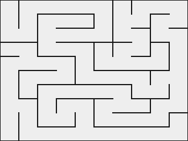

# mazegen

A simple maze generator using the [recursive backtracking algorithm](https://en.wikipedia.org/wiki/Maze_generation_algorithm#Recursive_implementation).

mazegen is a simple implementation of the recursive backtracking algorithm and
was made as a way of learning the [zig programming language](https://ziglang.org).

## Dependencies 

`zig >= 0.10.0`

`libSDL2`

## Usage

```sh
$ zig build
$ ./zig-out/bin/mazegen
Generate awesome mazes with the recursive backtracking algorithm

Usage:
  ./zig-out/bin/mazegen <width> <height> <seed*>

Options:

  width:             usize integer
  height:            usize integer
  seed (*optional):  unsigned 64-bit integer  default = random

$ ./zig-out/bin/mazegen 10 10
$ ./zig-out/bin/mazegen 20 20 42
```



## Contributing

Check out [ISSUES.md](ISSUES.md) for things to do and send a PR.

## License

[MIT](https://choosealicense.com/licenses/mit/)
